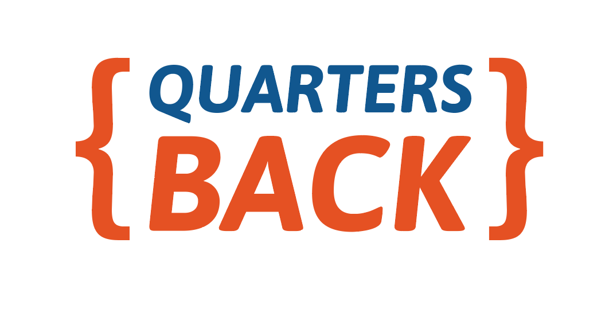
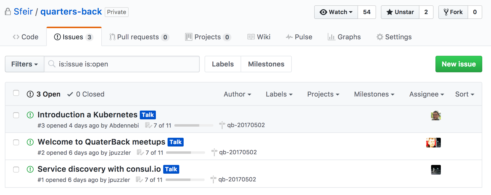
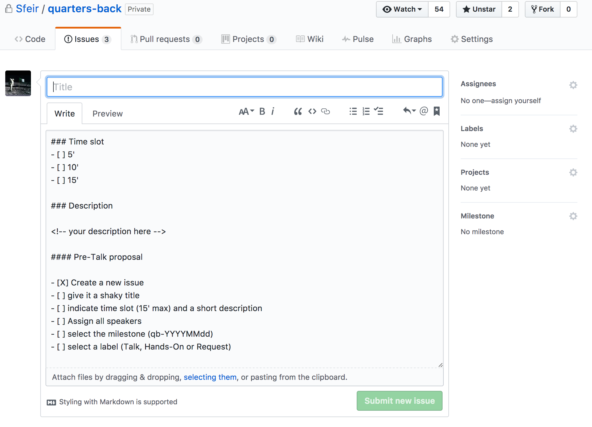
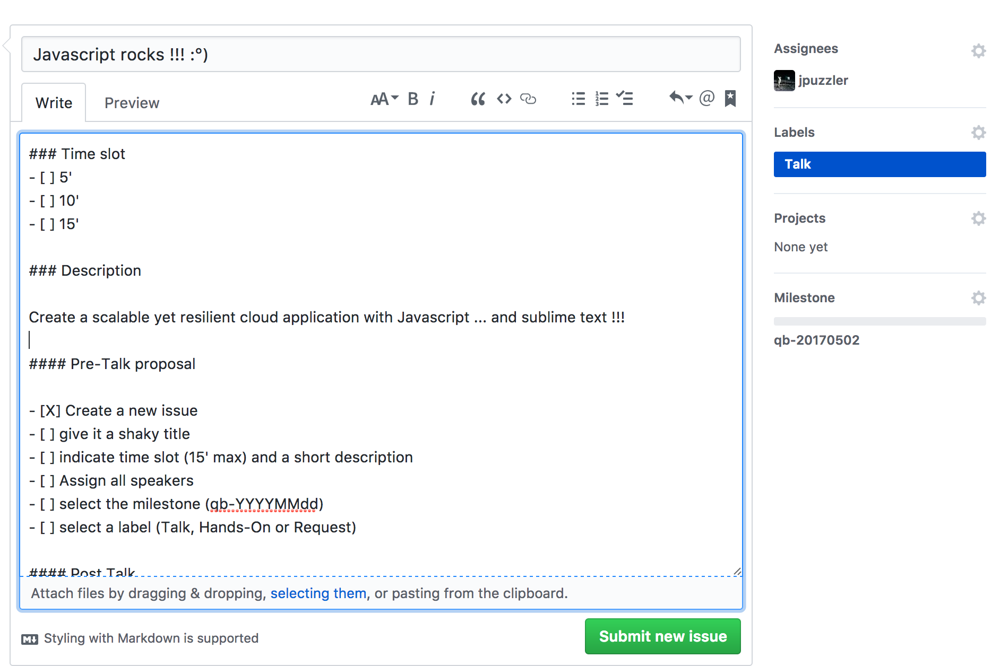
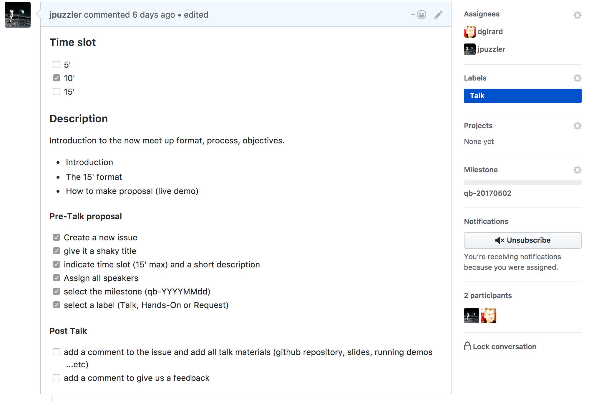

### Meeting index 
- [Mai 2nd 2017](https://github.com/Sfeir/quarters-back/milestone/1)
- [June 6th 2017](https://github.com/Sfeir/quarters-back/milestone/2) ?

# Quarters Back

> ### Welcome to landing page of the new SFEIR back meetups.

The idea behind those meetups is to keep up to date with state of the art about all technologies evolving around so called **the back-end** in the software development industry.

All Languages, architecutres and languages are welcome.

The 'Quarters Back' meetups are open for all with respect of the following :

- make a proposal by adding an [new issue](https://github.com/Sfeir/quarters-back/issues/new) on the current repository
- Talks must not exceed 15' 
- All technologies, technics, architectures ...etc are welcome
- Demos are welcome

SFEIR will offer snacks and drinks and all events will be held in SFEIR head quarters and start generally at 18h30

## Pre-Talk proposal

### Create a new issue and give it a `shaky` title

### We've provided you with an issue template

### Add Label, Assignees and a milestone

### Greate, you're done !

## Post Talk
- [ ] add a comment to the issue and add all talk materials (github repository, slides, running demos ...etc)
- [ ] add a comment to give us a feedback 

## Now you're really done :smile:
