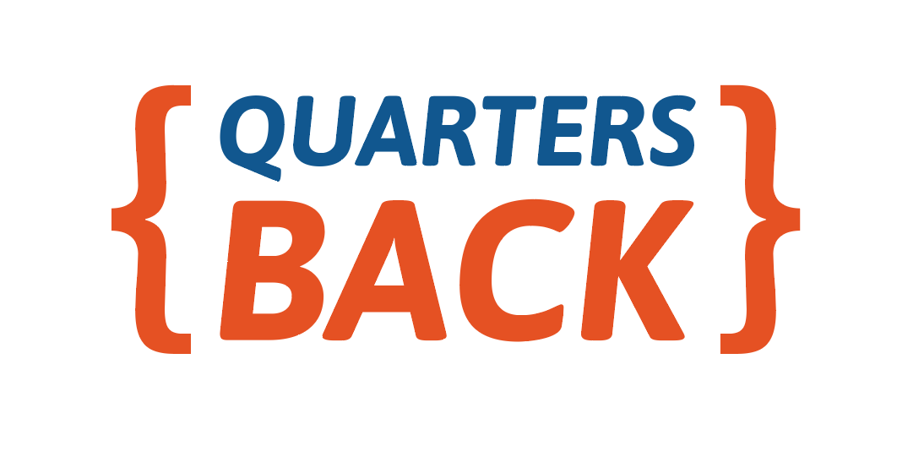
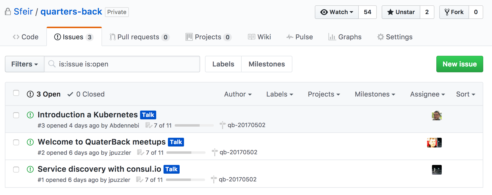
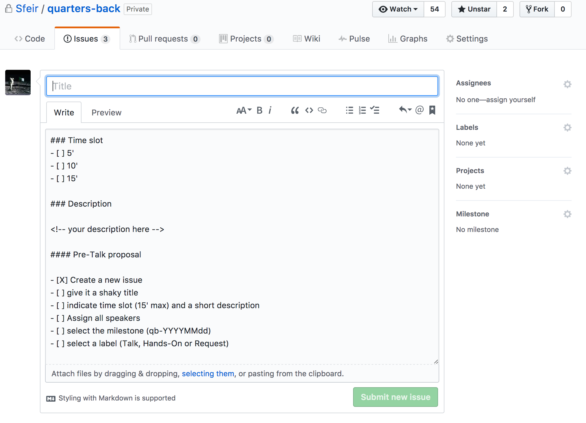
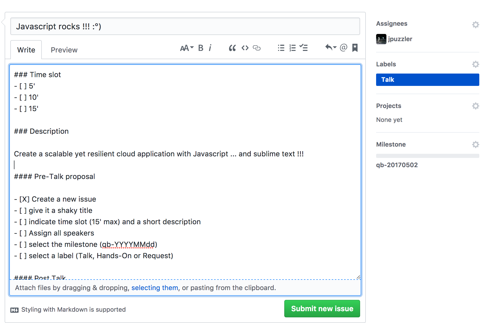
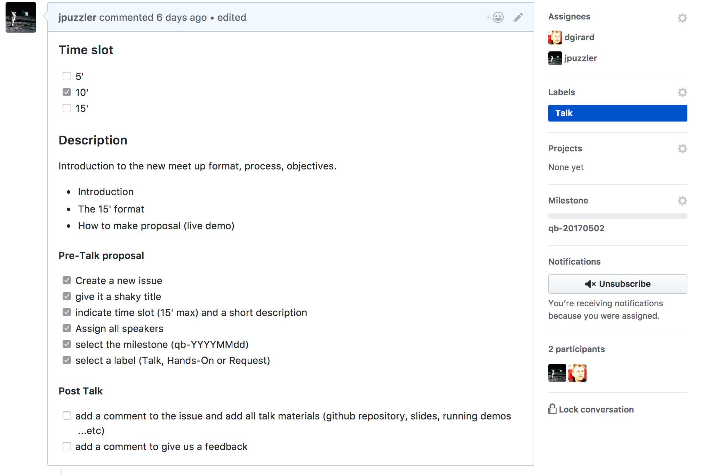

<!-- ### Archived -->

### Latest News
- [May 2nd 2017](https://github.com/Sfeir/quarters-back/milestone/1) *confirmed*
- [May 18th 2017 Hashicorp User Group Meetup HUG](https://github.com/Sfeir/quarters-back/milestone/3) *processing...*
- [June 6th 2017](https://github.com/Sfeir/quarters-back/milestone/2) ?

# Quarters Back

> ### Welcome to landing page of the new SFEIR back meet-ups.

The idea behind those meet-ups is to keep up to date with state of the art about all technologies evolving around so 
called **the back-end** in the software development industry.

All Languages, architectures and languages are welcome.

The 'Quarters Back' meet-ups are open for all with respect of the following :

- make a proposal by adding an [new issue](https://github.com/Sfeir/quarters-back/issues/new) on the current repository
- Talks must not exceed **15' (experimental)** 
- All technologies, architectures ...etc are welcome
- Demos are welcome
- Come as you are, talk about what ever you want the you way you want.

>
> **SFEIR** will offer :pizza: and :tropical_drink: and all events will be held in SFEIR head quarters and start generally at :hourglass: 18h30
>

# How to make a Talk proposal ?

## Pre-Talk proposal

### Create a new issue and give it a `shaky` title

### We've provided you with an issue template

### Add Label, Assignees and a milestone

### Great, you're done ! ... almost

## Post Talk
- [ ] add a comment to the issue and add all talk materials (github repository, slides, running demos ...etc)
- [ ] add a comment to give us a feedback 

## Now you're really done :smile:
