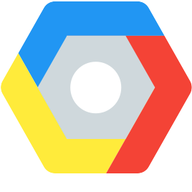

<!-- ### Archived 
### External Events
- [Hashicorp User Group Meetup HUG](https://github.com/Sfeir/quarters-back/milestone/1000) *reported...*
### Touchdowns
- [May 2nd 2017](https://github.com/Sfeir/quarters-back/releases/tag/qb-20170502) *released*
- [June 6th 2017](https://github.com/Sfeir/quarters-back/releases/tag/qb-20170606) *released*
- [July 4th 2017](https://github.com/Sfeir/quarters-back/releases/tag/untagged-0de37cfd7faeec7fb839) *CANCELLED*
- [September 5th 2017](https://github.com/Sfeir/quarters-back/releases/tag/qb-20170912) *released on September 12th*
- [October 17th 2017](https://github.com/Sfeir/quarters-back/milestone/5) *confirmed*
- [November 14th 2017](https://github.com/Sfeir/quarters-back/milestone/6) 
- Server Side Javascript [February 9th 2018](https://github.com/Sfeir/quarters-back/milestone/8)
- Happy Birthday Quarter Backs [May 22nd 2018](https://github.com/Sfeir/quarters-back/milestone/11) 
- **Cloud Native Applications** [Tuesday July 10th 2018](https://github.com/Sfeir/quarters-back/milestone/12) 

> - **Nuts and Bolts** [August 21st 2018](https://github.com/Sfeir/quarters-back/milestone/15) - [Register](https://sfeir.facebook.com/events/1864748226915116/)
> - **Kotlin** [September 11th 2018](https://github.com/Sfeir/quarters-back/milestone/13) - [Register](https://sfeir.facebook.com/events/271065980146745/)
-->

### Quarter Backs is a meetup happening once a month at SFEIR facilities. It's an open source meetup made by developers for developers.

> # Coming Session

> - **Google Container Tools** with **David Gageot** from *Google* [October 23rd 2018](https://github.com/Sfeir/quarters-back/milestone/17) - [Register](#)
> - Service Mesh [November 13th 2018](https://github.com/Sfeir/quarters-back/milestone/16)

Please follow steps in [CONTRIBUTING.md](CONTRIBUTING.md) to learn how to contribute to the meetup
